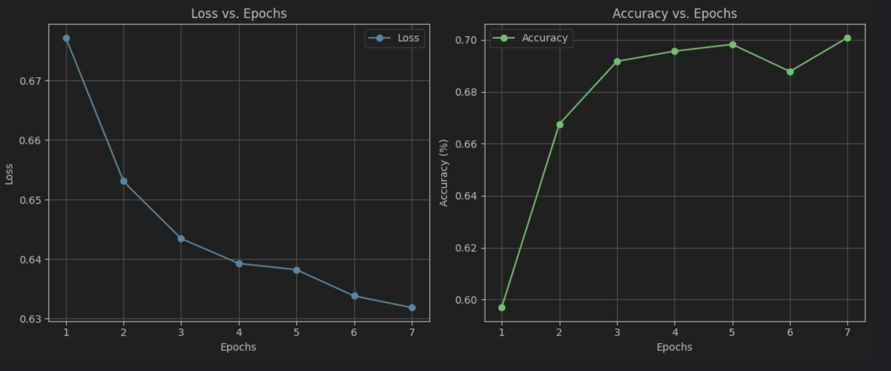

# Audio Deepfake Detection - Model Comparison

## 📌 Project Overview
This project aims to compare different deep learning models for detecting spoofed audio. The task is to classify audio files as either **real** or **spoofed**, using the **ASVspoof 2019 (Logical Access) dataset**. Throughout this project, we evaluate the performance of three models:

- **RawNet**
- **ResNet**
- **Wav2Vec 2.0**

By training all models on the same dataset and using a consistent preprocessing pipeline, we aim to fairly compare their effectiveness in detecting synthetic speech.

---

## 📂 Dataset - ASVspoof 2019 (Logical Access)
The **ASVspoof 2019 LA dataset** consists of real and AI-generated speech samples. The dataset is structured as follows:
- **Real Speech:** Genuine human voices
- **Spoofed Speech:** Speech generated using various text-to-speech (TTS) and voice conversion (VC) algorithms
- **Format:** `.flac` audio files
- **Metadata:** A CSV file containing filenames and corresponding labels (real/spoof)

We preprocess the dataset differently depending on the model, as detailed below.

---

## Data overview:
### Audio file features:
**MFCC (Mel-Frequency Cepstral Coefficients)** is a widely used feature extraction technique in audio signal processing, particularly for speech and audio classification tasks. It is designed to capture the short-term power spectrum of an audio signal in a way that is more aligned with human auditory perception. 

###  Audio example file - mel spectogram:


## 🔄 Data Preprocessing
Each model requires different preprocessing techniques to transform raw audio into a suitable input format.

### **1️⃣ RawNet** (End-to-End Deep Learning)
- Converts `.flac` files into **1D raw waveform vectors**.
- No need for handcrafted feature extraction.
- Directly inputs the waveform into the network.

### **2️⃣ ResNet** (CNN-Based)
- Extracts **MFCC (Mel Frequency Cepstral Coefficients)** as input features.
- Generates **Mel Spectrograms** to visualize audio patterns.
- Unlike RawNet, this model relies on spectral representations.

### **3️⃣ Wav2Vec 2.0** (Transformer-Based)
- Requires raw audio converted into a **1D vector**.
- Pretrained on a large corpus of speech data, making it useful for transfer learning.
- Uses a transformer-based approach to learn representations from waveforms.

#### **Example: Mel Spectrogram (Used for ResNet)**


---

## 🎛️ Data Augmentation Techniques
To improve model robustness and generalization, we applied several **audio augmentation techniques**:

### **1️⃣ Time Stretching**
- Changes the speed of the audio without altering pitch.
- Helps models learn variations in speech tempo.

### **2️⃣ Pitch Shifting**
- Modifies the pitch of the audio while keeping duration constant.
- Useful for handling different voice tones and speaker variations.

### **3️⃣ Additive Noise**
- Injects Gaussian/white noise into the audio.
- Simulates real-world background noise and improves generalization.

### **4️⃣ Reverberation (Echo Effects)**
- Mimics different room environments by adding reverb effects.
- Helps the model generalize to recordings from different locations.

### **5️⃣ Equalization (EQ Variations)**
- Alters frequency response to simulate different microphone qualities.
- Useful for handling recordings from different sources.

### **6️⃣ Time Masking (SpecAugment)**
- Masks random sections of the audio waveform to force the model to learn context.
- Similar to dropout in neural networks, improving generalization.

### **7️⃣ Frequency Masking**
- Randomly removes certain frequency bands.
- Helps the model become invariant to minor frequency shifts in speech.

These augmentations were applied dynamically during training to increase dataset diversity and improve model robustness.

## 🏗️ Model Architectures
### **RawNet**
- End-to-end deep learning model for audio classification.
- Uses **ResBlocks** to learn directly from raw waveforms.
- Extracts feature representations automatically without explicit transformations.

### **ResNet (Convolutional Neural Network - CNN)**
- Uses convolutional layers to learn patterns in **MFCC features**.
- Typically used for image-like structured inputs, making it effective for spectrogram-based classification.

### **Wav2Vec 2.0 (Self-Supervised Learning - Transformer-Based)**
- A state-of-the-art transformer-based model for speech representation learning.
- Pretrained on large speech datasets, reducing the need for extensive labeled data.
- Works directly with **raw waveforms** like RawNet but leverages transformer layers.

---

## 🚀 Training Setup

### **RawNet:**

Model was trained only on last layers, due to its size and training power needed

- **Batch Size:** `32`
- **Learning Rate:** `0.01`
- **Optimizer:** `Adam`
- **Epochs:** `10`
- **Loss Function:** Cross-entropy loss

### **ResNet:**
- **Batch Size:** `256`
- **Learning Rate:** `0.001`
- **Optimizer:** `RMSProp`
- **Epochs:** `6`
- **Loss Function:** Cross-entropy loss

### **Wav2Vec:**
Model was trained only on last layers, due to its size and training power needed
- **Batch Size:** `16`
- **Learning Rate:** `0.001`
- **Optimizer:** `Adam`
- **Epochs:** `5`
- **Loss Function:** Cross-entropy loss

We used **mps, T4-GPU & GTX Ti 1650** to accelerate training.

---

## 📊 Model Evaluation & Results
After training, we evaluated the models on a held-out test set. Here are the key evaluation metrics:
- **Accuracy**
- **Precision & Recall**
- **F1-Score**
- **Equal Error Rate (EER)** (commonly used in speaker verification tasks)

| Model       | Accuracy | Precision | Recall | F1-Score | EER   |
|------------|----------|----------|------|--------|-------|
| RawNet     | XX%      | XX%      | XX%  | XX%    | XX%   |
| ResNet     | 0.898    | 0.898    | 1.00 | 0.964 | 0.5   |
| Wav2Vec 2.0 | 0.7  | 0.99     | 0.666 | 0.79    | 0.251 |

### Rawnet training process:


### Resnet training process:


### **Key Insights**
- **RawNet performed best/worst due to `INSERT_REASON`**.
- **ResNet showed strengths in identyfing all test spoofed data! **.
- **Wav2Vec 2.0 was dissapointing in it's results, giving the advanced Transformer tech it's using **.

---

## 🛠️ How to Use This Repository
### ** Clone the Repository**
```bash
git clone https://github.com/Roee97/Fake-Voice-Detection.git
cd Fake-Voice-Detection
```

### ** Use the trained models for getting the model for evaluation, for example: **
```python
import torch
from models.wav2vec_modified import Wav2Vec2BinaryClassifier
model = Wav2Vec2BinaryClassifier()
model_path = "trained_models/wav2vec_model_weights.pth"
device = torch.device("cuda" if torch.cuda.is_available() else "cpu")
model.load_state_dict(torch.load(model_path, map_location=device))
```
---

## 📌 Future Work
- Test on a different fake method dataset, for example Celeb-DF & mix different fake methods
for better generalization
- Fine-tune **Wav2Vec 2.0** on this dataset for better results.

---

## ✨ Contributors
- **Roee Seren** - [GitHub Profile](https://github.com/Roee97)

## Sources
### Network performance metrics:
https://www.v7labs.com/blog/f1-score-guide

### RawNet Deepening explanation:
https://www.isca-archive.org/interspeech_2019/jung19b_interspeech.pdf

### Wav2Vec Deepening explanation:
https://www.geeksforgeeks.org/wav2vec2-self-a-supervised-learning-technique-for-speech-representations/

### ResNet Deepening explanation:
https://www.geeksforgeeks.org/residual-networks-resnet-deep-learning/

